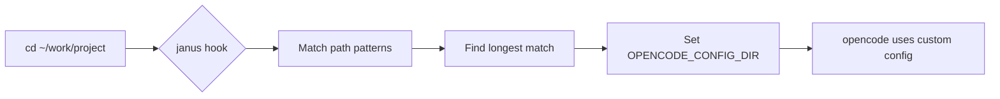

<div align="center">

# 🔀 Janus

**Directory-aware OpenCode configuration switcher**

*Named after the Roman god of transitions—seamlessly transform your configuration as you navigate between projects*

[](https://www.npmjs.com/package/opencode-janus)
[](https://www.npmjs.com/package/opencode-janus)
[](https://github.com/kuitos/janus/blob/main/LICENSE)
[](https://nodejs.org)

[Features](#-features) • [Quick Start](#-quick-start) • [Configuration](#%EF%B8%8F-configuration) • [How It Works](#-how-it-works)

</div>

---

## ✨ Features

<table>
<tr>
<td width="50%">

### 🎯 Smart Path Matching
Automatically detects your working directory and applies the right configuration

</td>
<td width="50%">

### ⚡ Zero Overhead
Lightweight shell integration with instant switching

</td>
</tr>
<tr>
<td width="50%">

### 🔒 Process Isolation
Each OpenCode instance runs with its own isolated configuration

</td>
<td width="50%">

### 🎨 Flexible Patterns
Full glob pattern support with longest-prefix priority

</td>
</tr>
</table>

## 🚀 Quick Start

### Installation

```bash
npm install -g opencode-janus
```

<details>
<summary>Alternative: Install from source</summary>

```bash
git clone https://github.com/kuitos/janus.git
cd janus
bun install && bun run build
npm install -g .
```

</details>

### Setup in 3 steps

```bash
# 1. Create your configuration file
mkdir -p ~/.config/janus
nano ~/.config/janus/config.json

# 2. Install shell hook (auto-detects zsh/bash)
janus install

# 3. Reload your shell
source ~/.zshrc  # or ~/.bashrc
```

**That's it!** 🎉 Your `opencode` command now adapts to each directory.

## ⚙️ Configuration

Create `~/.config/janus/config.json` with your mapping rules:

```jsonc
{
  "mappings": [
    {
      "match": ["/Users/yourname/work/**"],        // Company projects
      "configDir": "/Users/yourname/.config/opencode-work"
    },
    {
      "match": ["/Users/yourname/projects/oss/**"], // Open source
      "configDir": "/Users/yourname/.config/opencode-oss"
    },
    {
      "match": ["/Users/yourname/personal/**"],     // Personal projects
      "configDir": "/Users/yourname/.config/opencode-personal"
    }
  ]
}
```

### Configuration Structure

Each `configDir` should contain:

```
~/.config/opencode-work/
├── opencode.json           # OpenCode settings
└── oh-my-opencode.json     # oh-my-opencode plugins
```

<details>
<summary>📖 Configuration Reference</summary>

| Field | Type | Description |
|-------|------|-------------|
| `mappings` | `Array` | List of directory-to-config mapping rules |
| `match` | `string[]` | Path patterns to match (supports `**` glob) |
| `configDir` | `string` | Absolute path to configuration directory |

**Pattern Matching:**
- Supports glob patterns: `**`, `*`, `?`
- Supports tilde (`~`) expansion for home directory
- Multiple patterns per mapping
- Longest (most specific) match wins

**Path Examples:**
```jsonc
{
  "mappings": [
    {
      "match": ["~/work/**"],           // ✅ Tilde expanded to home directory
      "configDir": "~/.config/work"     // ✅ Also supports tilde
    },
    {
      "match": ["/absolute/path/**"],   // ✅ Absolute path
      "configDir": "/absolute/config"
    }
  ]
}
```

</details>

## 💡 How It Works



1. **Shell Integration** – Hook runs on directory change
2. **Path Resolution** – Matches current path against patterns
3. **Priority Selection** – Longest (most specific) pattern wins
4. **Environment Setup** – Sets `OPENCODE_CONFIG_DIR` for the session
5. **Isolated Execution** – Each process gets the right configuration

## 🛠️ Commands

```bash
janus install    # Install shell hook (auto-detects shell)
janus uninstall  # Remove shell hook
janus --version  # Show version
janus --help     # Show help
```

## 🧪 Development

```bash
# Run tests
bun test

# Coverage report
bun test --coverage

# Type checking
bun run typecheck

# Build for production
bun run build
```

## 📦 Project Structure

```
src/
├── cli.ts              # CLI entry point
├── config.ts           # Configuration loading & validation
├── resolver.ts         # Path matching engine
├── install.ts          # Shell hook installer
├── shell-hook.ts       # Hook generation logic
├── types.ts            # TypeScript definitions
└── *.test.ts           # Comprehensive test suite
```

## 🤝 Contributing

Contributions are welcome! Feel free to:

- 🐛 [Report bugs](https://github.com/kuitos/janus/issues)
- 💡 [Suggest features](https://github.com/kuitos/janus/issues)
- 🔧 [Submit pull requests](https://github.com/kuitos/janus/pulls)

## 📄 License

[MIT](LICENSE) © [kuitos](https://github.com/kuitos)

## 🙏 Acknowledgments

Built with ❤️ using:
- [Bun](https://bun.sh) – Fast all-in-one JavaScript runtime
- [Zod](https://zod.dev) – TypeScript-first schema validation

Inspired by:
- [direnv](https://direnv.net/) – Environment switcher for the shell
- [projj](https://github.com/popomore/projj) – Project management tool
