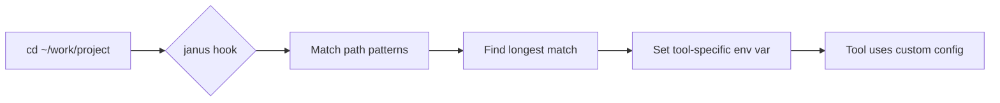

<div align="center">

# 🔀 Janus

**Directory-aware configuration switcher for OpenCode & Claude Code**

*Named after the Roman god of transitions—seamlessly transform your configuration as you navigate between projects*

[](https://www.npmjs.com/package/opencode-janus)
[](https://www.npmjs.com/package/opencode-janus)
[](https://github.com/kuitos/janus/blob/main/LICENSE)
[](https://nodejs.org)

[Features](#-features) • [Quick Start](#-quick-start) • [Configuration](#%EF%B8%8F-configuration) • [How It Works](#-how-it-works)

</div>

---

## ✨ Features

<table>
<tr>
<td width="50%">

### 🎯 Smart Path Matching
Automatically detects your working directory and applies the right configuration

</td>
<td width="50%">

### ⚡ Zero Overhead
Lightweight shell integration with instant switching

</td>
</tr>
<tr>
<td width="50%">

### 🔒 Process Isolation
Each tool instance runs with its own isolated configuration

</td>
<td width="50%">

### 🎨 Flexible Patterns
Full glob pattern support with longest-prefix priority

</td>
</tr>
<tr>
<td width="50%">

### 🧩 Multi-Tool Support
Shared mapping rules for OpenCode, Claude Code, and more

</td>
<td width="50%">

### 🔄 Backward Compatible
Existing single-tool configs continue to work without changes

</td>
</tr>
</table>

## 🚀 Quick Start

### Installation

```bash
npm install -g opencode-janus
```

<details>
<summary>Alternative: Install from source</summary>

```bash
git clone https://github.com/kuitos/janus.git
cd janus
bun install && bun run build
npm install -g .
```

</details>

### Setup in 3 steps

```bash
# 1. Create your configuration file
mkdir -p ~/.config/janus
nano ~/.config/janus/config.json

# 2. Install shell hook (auto-detects zsh/bash)
janus install

# 3. Reload your shell
source ~/.zshrc  # or ~/.bashrc
```

**That's it!** 🎉 Your `opencode` and `claude` commands now adapt to each directory.

## ⚙️ Configuration

Create `~/.config/janus/config.json` with your mapping rules:

### Multi-Tool Configuration (Recommended)

```jsonc
{
  "defaultConfigDir": [
    { "tool": "opencode", "dir": "~/.config/opencode-default" },
    { "tool": "claude", "dir": "~/.config/claude-default" }
  ],
  "mappings": [
    {
      "match": ["~/work/**"],
      "configDir": [
        { "tool": "opencode", "dir": "~/.config/opencode-work" },
        { "tool": "claude", "dir": "~/.config/claude-work" }
      ]
    },
    {
      "match": ["~/projects/oss/**"],
      "configDir": [
        { "tool": "opencode", "dir": "~/.config/opencode-oss" },
        { "tool": "claude", "dir": "~/.config/claude-oss" }
      ]
    }
  ]
}
```

### Single-Tool Configuration (Backward Compatible)

```jsonc
{
  "defaultConfigDir": "~/.config/opencode-default",
  "mappings": [
    {
      "match": ["~/work/**"],
      "configDir": "~/.config/opencode-work"
    },
    {
      "match": ["~/projects/oss/**"],
      "configDir": "~/.config/opencode-oss"
    }
  ]
}
```

> String format `configDir` is treated as OpenCode shorthand — no migration needed.

### Supported Tools

| Tool | Command | Environment Variable |
|------|---------|---------------------|
| OpenCode | `opencode` | `OPENCODE_CONFIG_DIR` |
| Claude Code | `claude` | `CLAUDE_CONFIG_DIR` |

These are built-in — you only need to specify `tool` and `dir` in your config.

<details>
<summary>📖 Configuration Reference</summary>

| Field | Type | Required | Description |
|-------|------|----------|-------------|
| `defaultConfigDir` | `string \| [{tool, dir}]` | No | Fallback configuration when no mappings match |
| `mappings` | `Array` | Yes | List of directory-to-config mapping rules |
| `match` | `string[]` | Yes | Path patterns to match (supports `**` glob) |
| `configDir` | `string \| [{tool, dir}]` | Yes | Configuration directory per tool |

**Pattern Matching:**
- Supports glob patterns: `**`, `*`, `?`
- Supports tilde (`~`) expansion for home directory
- Multiple patterns per mapping
- Longest (most specific) match wins
- Falls back to `defaultConfigDir` if configured and no match found

**Path Examples:**
```jsonc
{
  "defaultConfigDir": [
    { "tool": "opencode", "dir": "~/.config/opencode-default" }
  ],
  "mappings": [
    {
      "match": ["~/work/**"],
      "configDir": [
        { "tool": "opencode", "dir": "~/.config/work" },
        { "tool": "claude", "dir": "~/.config/claude-work" }
      ]
    },
    {
      "match": ["/absolute/path/**"],
      "configDir": "~/.config/opencode-absolute"
    }
  ]
}
```

**Default Configuration Behavior:**
- When a directory doesn't match any pattern in `mappings`, `defaultConfigDir` is used (if configured)
- If `defaultConfigDir` is not set, unmatched directories will not use any configuration (backward compatible)
- Useful for providing a general-purpose configuration for casual projects

</details>

## 💡 How It Works


```mermaid
graph LR
    A[cd ~/work/project] --> B{janus hook}
    B --> C[Match path patterns]
    C --> D[Find longest match]
    D --> E[Set tool-specific env var]
    E --> F[Tool uses custom config]
```

1. **Shell Integration** – `janus install` adds wrapper functions for each tool
2. **Path Resolution** – Matches current path against patterns
3. **Priority Selection** – Longest (most specific) pattern wins
4. **Environment Setup** – Sets the correct env var per tool (`OPENCODE_CONFIG_DIR`, `CLAUDE_CONFIG_DIR`)
5. **Isolated Execution** – Each process gets the right configuration

### Shell Hook Example

After `janus install`, your shell RC file contains:

```bash
# >>> janus auto-initialization >>>
opencode() {
  janus exec --tool opencode -- "$@"
}
claude() {
  janus exec --tool claude -- "$@"
}
# <<< janus auto-initialization <<<
```

## 🛠️ Commands

```bash
janus install    # Install shell hook (auto-detects shell & tools from config)
janus uninstall  # Remove shell hook
janus --version  # Show version
janus --help     # Show help
```

## 🧪 Development

```bash
# Run tests
bun test

# Coverage report
bun test --coverage

# Type checking
bun run typecheck

# Build for production
bun run build
```

## 🤝 Contributing

Contributions are welcome! Feel free to:

- 🐛 [Report bugs](https://github.com/kuitos/janus/issues)
- 💡 [Suggest features](https://github.com/kuitos/janus/issues)
- 🔧 [Submit pull requests](https://github.com/kuitos/janus/pulls)

## 📄 License

[MIT](LICENSE) © [kuitos](https://github.com/kuitos)

## 🙏 Acknowledgments

Built with ❤️ using:
- [Bun](https://bun.sh) – Fast all-in-one JavaScript runtime
- [Zod](https://zod.dev) – TypeScript-first schema validation

Inspired by:
- [direnv](https://direnv.net/) – Environment switcher for the shell
- [projj](https://github.com/popomore/projj) – Project management tool
